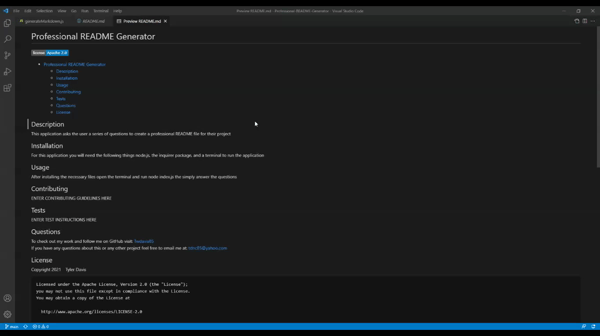

# Professional README Generator

- [Professional README Generator](#professional-readme-generator)
  - [Description](#description)
  - [Installation](#installation)
  - [Usage](#usage)
  - [Demo](#demo)
  - [Repository](#repository)
  - [Questions](#questions)
  - [License](#license)

## Description
This application asks the user a series of questions to create a professional README file for their project
## Installation
For this application you will need the following things node.js, the inquirer package, and a terminal to run the application
## Usage
After installing the necessary files open the terminal and run node index.js then simply answer the questions
## Demo
[Link to Demo](https://drive.google.com/file/d/1vHAYVlIpMvvnLy3bWLRUH3fe69y6zsrJ/view)  
[Table of Contents Demo](https://drive.google.com/file/d/1HV4VAOB0ysG5kIbf-_ZpBN5OXT1aIOlV/view)
## Repository
[GitHub Repository](https://github.com/Twdavis85/Professional-README-Generator)
## Questions
To check out my work and follow me on GitHub visit: [Twdavis85](https://github.com/Twdavis85)  
If you have any questions about this or any other project feel free to email me at: [tdnc85@yahoo.com](mailto:tdnc85@yahoo.com)

## License
Copyright  2021 &ensp; Tyler Davis

    Licensed under the Apache License, Version 2.0 (the "License");
    you may not use this file except in compliance with the License.
    You may obtain a copy of the License at
 
      http://www.apache.org/licenses/LICENSE-2.0
 
    Unless required by applicable law or agreed to in writing, software
    distributed under the License is distributed on an "AS IS" BASIS,
    WITHOUT WARRANTIES OR CONDITIONS OF ANY KIND, either express or implied.
    See the License for the specific language governing permissions and
    limitations under the License.